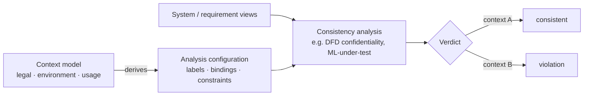

# .github
# ☕ MOCCAVI

**MO**del **C**onsistency with **C**ontext **A**ugmentation for **VI**ew-based systems

> Same system, different context, different verdict — and that is correct behavior.

---

## The idea

Requirements and system models evolve side by side, but their consistency is rarely checked — and where analyses do check it, they check it **context-free**. In practice that is wrong: the same architecture can be compliant for an EU hospital and a confidentiality violation on a US cloud. Today that knowledge sits in the modeller's head, hard-coded into hand-written labels and constraints.

MOCCAVI makes **context an explicit, reusable model** with a **generic interface to arbitrary consistency analyses**. The same context apparatus derives the labels and constraints of a DFD confidentiality analysis and the test data an ML component is judged against — integrated into view-based development, with AI supporting authoring and judging.

Swap the context, and the **same** architecture yields a different — correct — verdict.

## Status

🚧 **Early stage.** MOCCAVI is the umbrella for an ongoing dissertation project at the Karlsruhe Institute of Technology (KIT). Repositories will appear here as the components mature:

| Component | Purpose | Status |
|---|---|---|
| `context-metamodel` | The generic context model (Ecore) and its analysis interface | in design |
| `derivation` | Context instance → analysis configuration | planned |
| `vitruvius-adapter` | Running analyses as consistency checks in a VSUM ([Vitruvius](https://vitruv.tools)) | planned |
| `examples` | DFD systems under ≥2 contexts with expected verdicts (evaluation gold standard) | planned |

## Built on / related

- [**xDECAF**](https://dataflowanalysis.org) — extensible DFD analysis framework for information security; the first analysis instance MOCCAVI augments with context
- [**Vitruvius**](https://vitruv.tools) — view-based development with a virtual single underlying model; the integration substrate
- **ARCOVIA** — automated repair of confidentiality violations in software architectures; the repair-side sibling

## Publications

Coming soon — the context metamodel paper is in preparation.

## Contact

Benjamin Arp · Karlsruhe Institute of Technology (KIT)
Found a use case where context should change an analysis verdict? Open an issue or reach out.

## License

Code in this organization is released under EPL-2.0 unless a repository states otherwise.
